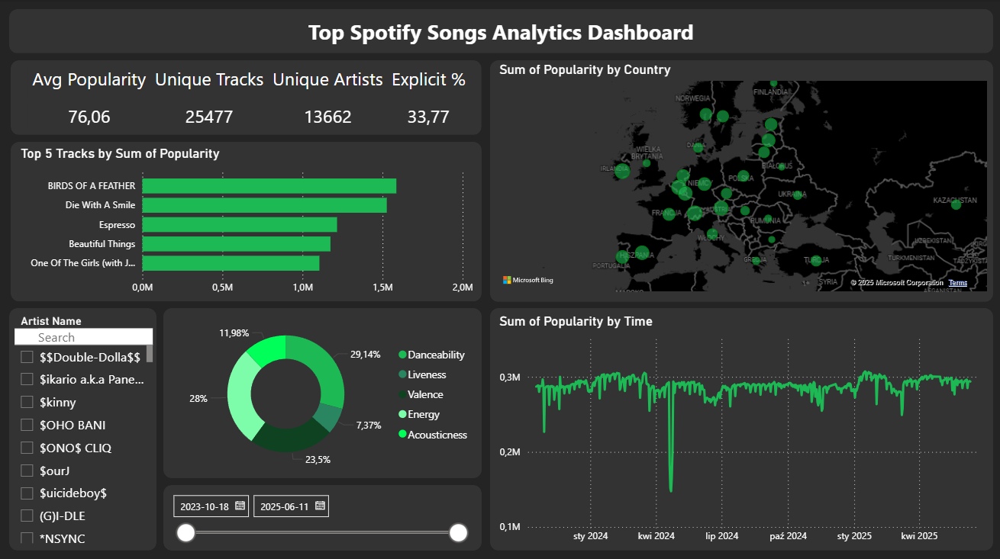

# 🎧 Top Spotify Songs Analytics Dashboard


---



An interactive **Power BI dashboard** analyzing **Top Spotify Songs** across 73 countries. It provides insights into **song popularity trends, audio features, and artist performance** using a **star-schema data model** built in SQL Server.

---

## 📊 Features

* **Global Popularity Trends**

  * Track daily popularity of top songs across countries.
  * Visualize **popularity by country** with an interactive map.

* **Audio Feature Analysis**

  * Compare **danceability, energy, valence, acousticness, liveness** of top songs.
  * Understand the emotional/energy profiles of tracks.

* **Key KPIs**

  * **Avg Popularity**
  * **Unique Tracks & Artists**
  * **Explicit Content %**

* **Interactivity**

  * **Search and filter** by Artist and Date Range.
  * All visuals cross-filter for deep dive analysis.

---

## 🛠 Tech Stack

* **Data Source**: [Kaggle – Top Spotify Songs in 73 Countries (Daily Updated)](https://www.kaggle.com/datasets/asaniczka/top-spotify-songs-in-73-countries-daily-updated)
* **Database**: SQL Server (ETL, data cleaning, star schema design)
* **Visualization**: Power BI Desktop
* **Languages**: SQL (data modeling), DAX (KPIs, calculations)

---

## 📂 Project Structure

```
spotify-analytics-dashboard/
│
├── data/
│   └── top_spotify_songs.csv        # Raw dataset (from Kaggle)
│
├── sql/
│   ├── 01_create_tables.sql         # Star schema table creation scripts
│   ├── 02_insert_data.sql           # Data loading scripts
│   └── 03_views_measures.sql        # Example analytical views
│
├── powerbi/
│   └── spotify_dashboard.pbix       # Power BI dashboard file
│
├── screenshots/
│   └── dashboard-preview.png        # Dashboard preview image
│
├── README.md
└── LICENSE
```

---

## 📂 SQL Scripts

* [**01\_create\_tables.sql**](./sql/01_create_tables.sql) – Creates dimension and fact tables
* [**02\_insert\_data.sql**](./sql/02_insert_data.sql) – Inserts cleaned Kaggle data into tables
* [**03\_views\_measures.sql**](./sql/03_views_measures.sql) – Example views for reporting layer

---

## 📈 Data Model

* **Fact Table**: `FactSpotifyHistory`

  * Contains track popularity, rank, explicit flag, and audio features
* **Dimension Tables**:

  * `DimArtist`
  * `DimTrack`
  * `DimAlbum`
  * `DimCountry`
  * `DimDate`

Star schema ensures fast aggregation and easy filtering.

---

## 📐 Key DAX Measures

```DAX
Unique Tracks = DISTINCTCOUNT ( 'Spotify Facts'[TrackKey] )
Unique Artists = DISTINCTCOUNT('Spotify Facts'[ArtistKey])
Count Explicit = CALCULATE(
  COUNTROWS('Spotify Facts'),
  'Spotify Facts'[IsExplicit] = TRUE()
)
Explicit % = DIVIDE(
  [Count Explicit],
  COUNTROWS('Spotify Facts'),
  0
)*100
```

Additional measures: **Danceability, Energy, Valence, Acousticness, Liveness** for feature analysis.

---

## 📊 Dashboard Overview

**Visuals Included:**

1. **KPI Cards** – Avg Popularity, Unique Tracks, Unique Artists, Explicit %
2. **Bar Chart** – Top 5 Tracks by Popularity
3. **Map** – Popularity by Country
4. **Donut Chart** – Audio Feature Distribution
5. **Line Chart** – Popularity Trend Over Time
6. **Slicer + Search** – Artist selection and Date range filter

**Design Highlights:**

* Dark theme with **Spotify green accents**
* One-page layout for simplicity and clarity
* Interactive filters and cross-highlighting

---

## 🚀 How to Run

### 1. Clone Repository

```bash
git clone https://github.com/yourusername/spotify-analytics-dashboard.git
cd spotify-analytics-dashboard
```

### 2. Prepare Database

* Load `top_spotify_songs.csv` into SQL Server
* Run `01_create_tables.sql` and `02_insert_data.sql`
* Optionally, create analytical views using `03_views_measures.sql`

### 3. Open Power BI Dashboard

* Open `spotify_dashboard.pbix`
* Connect to your SQL Server database
* Refresh visuals and explore interactivity

---

## 🎯 Insights

* **Danceability** and **energy** dominate top tracks’ features
* Explicit tracks account for \~33% of global top songs
* Consistent popularity spikes correlate with major album releases

---

## 👤 Author

**Szymon Janusz**
[LinkedIn](https://www.linkedin.com/in/szymon-janusz) • [Portfolio](https://github.com/szymon-janusz) • [Email](mailto:szymonjanusz0613@gmail.com)

---

## 📄 License

MIT License – see [LICENSE](./LICENSE) for details.
